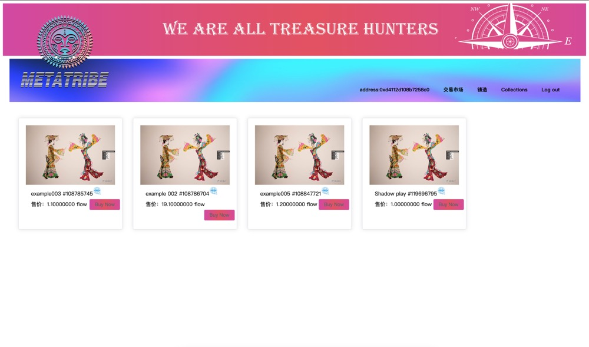

<p align="center">
  <a href="https://flow.com/">
    
  </a>
</p>

flow_vue3_marketplace_example: is a DApp example that includes front-end and Cadence smart contract trading marketplace. Functions: wallet interaction, NFT minting, NFT selling, market transaction functions. It can help beginners to quickly build their own DApp.Have a nice start!
## 1. Technology stack
  - Vue3
  - Element-Plus Component library
  - TypesCcript
  - Cadence

## 2. Basic Configuration
  For the basic configuration (nodejs, vue3, flow-cli), see: https://github.com/28356715/flow_vue3_elementplus_scaffolding

## 3. Clone the project
```sh
git clone https://github.com/28356715/flow_vue3_marketplace_example.git
```

## 4. IDE
- VSCode - [Download & Install VSCode.](https://code.visualstudio.com/) <br/>
- Install the plug-in in VSCode: cadence

## 5. Project setup
```sh
npm install
```
Note: If the Chinese community user cannot install the problem, you can try cnpm or reset the npm mirror

### Compiles and hot-reloads for development
```sh
npm run serve
```
### Compiles and minifies for production
```
npm run build
```

## 4.Directory Structure

 - \cadence: Cadence Contract.
 - \config\flow.config.js: Contract address configuration.
 - \src\assets: css & image.
 - \src\flow: Query scripts & transaction scripts, ts code interacts with the chain through these scripts.
 - \src\view: vue .
 - \src\main.ts: Entry file for the project.


